# Introducción

La coordinación de ingeniería de la computación realiza diversas tareas tanto académicas como administrativas. Una de ellas es la preparación, emisión y publicación de horarios para trimestres posteriores al actual. Luego, ante los estudiantes y a DACE (Dirección de Administración y Control de Estudios).

Durante las semanas finales de cada trimestre, la coordinación debe preparar y emitir la oferta de asignaturas. Los insumos para poder realizar el análisis de horarios se encuentra en diversos estilos de presentación y en al menos tres tipos de archivos. Por otra parte, no se emite una única oferta sino que se realizan varias revisiones de la misma debido a que DACE, realiza ajustes y correcciones de ella lo cual obliga a la coordinación a volver a repetir el proceso de preparación y emisión. 

Este proceso es realizado de forma manual. Dado que es necesario contrastar mucha información, es muy propenso a errores lo cual afecta la publicación fidedigna de las materias disponibles. La coordinadora realiza este proceso ante la falta de un asistente pero debe emplear mucho tiempo en los preparativos y el análisis.

En este miniproyecto de desarollo se analiza y se pretende solucionar este problema mediante la automatización del proceso. La implantación del programa se realizó en el lenguaje de programación Python y fue diseñada para ser utilizada en entornos de tipo Unix. No obstante, esto no impide que sea utilizada en otros entornos dada la característica multiplataforma de Python.

En este informe, se observa el problema a plenitud, estructura, diseño e implantación de la aplicación que automatiza esta tarea administrativa y, pruebas y resultados de la solución.

# Resumen

Una de las tareas de la coordinación de ingenieria de la computación, durante cada trimestre, es la preparación, emisión y publicación de los horarios de los trimestres posteriores al actual. Para realizar esta tarea, se requiere de las ofertas departamentales y una preoferta 0800. Se analiza cada oferta de los departamentos que tengan materias que correspondan al pensum de ingenieria de la computación contra la preoferta 0800. Se genera una primera preoferta que se envía a DACE (Dirección de Administración y Control de Estudios). Luego, esta preoferta se somete a continuos análisis, es decir, repetir la preparación cada vez que existen ajustes y/o correcciones por parte de DACE, hasta que no existan más. Finalmente, se publica a los estudiantes.

Este proceso es realizado de forma manual; la coordinadora es la única persona que puede hacerlo dada la carencia de un asistente relacionado con estas labores; es propenso a errores debido a la cantidad de información que una sola persona debe manejar. Estos factores implican que la preparación tome mucho tiempo.

En este miniproyecto, se diseñó e implantó con éxito una aplicación que automatiza y soluciona este problema con ciertas condiciones. Concretamente, se implantó procesadores de texto para documentos DOC, XLS y PDF como la base la aplicación; luego, se construyó una aplicación principal que realiza las emisiones de ofertas bajo determinadas reglas de la coordinación. 

Se realizaron 32 casos de prueva en total, que consiste en: dos de propósito de la aplicación y el resto en pruebas de procesamiento de texto. Un caso de prueba importante fue realizar la preparación y emisión de la oferta del trimestre enero-marzo 2017.

# Planteamiento del problema

Trimestralmente la coordinación de ingenieria de la computación prepara, emite y publica a DACE las ofertas de materias, de acuerdo al pensum vigente, para los posteriores trimestres.

Las ofertas de materias consisten en asignaturas que los departamentos proporcionan a cada carrera dentro de la universidad de acuerdo al pensum. Lo anterior se denominan ofertas departamentales. Las tales se presentan bajo diferentes formatos y archivos; hasta ahora se conocen que los archivos entregados son PDF, DOC, XLS (Excel) y XLSX. Por otra parte, las ofertas son escritas de acuerdo a ciertos estilo de presentación de la información que varia entre departamentos. Cada oferta consiste en renglones compuestos de:

* código de asignatura
* bloque
* horario.

Cada renglón debe ser examinado contra un borrador de ofertas que la coordinación dispone; en cada caso se agrega, elimina o modifica su inclusión al borrador. Luego de este examen, se produce un borrador tentativo se que envia a DACE.

Sin embargo, la oferta producida no se da por terminada ya que está sujeta a varias revisiones conforme DACE la dicte. Esto significa que el proceso anteriormente descrito se repita hasta que no hayan nuevas versiones por parte de DACE.

Todo el proceso anteriormente descrito es realizado de forma manual por la coordinación. Es propenso a cometer errores debido a la cantidad de información que se debe analizar y comparar. Esto afecta en la publicación fidedigna de la oferta de asignaturas. Ante la falta de un asistente, la coordinadora es la persona encargada de realizar este trabajo el cual consume una buena parte del tiempo en su preparación y revisión.


# Objetivos

* Implementación de una aplicación que permita la integración de los horarios de las asignaturas enviados por los distintos departamentos.

* Analizar, modificar e integrar ofertas provenientes de los diferentes departamentos que ofertan materias a la coordinación de ingeniería de la computación.

* Facilitar y automatizar la gestión de los horarios en los trámites académicos de la coordinación.


# Análisis

El flujo de trabajo del procesador de horarios es similar al proceso expuesto en el planteamiento del problema. Es modelado por dos etapas con sus constituyentes:

* **Etapa 1**:
    * Ofertas departamentales, oferta 0800 y diccionario de materias.
    * Análisis y comparación.
    * Emisión de preoferta a DACE
* **Etapa 2:**
    * Análisis y comparación con nueva oferta de DACE.
    * Generación de oferta trimestral.

## Etapa 1

En esta etapa, se reune todas las ofertas departamentales y una preoferta 0800 como alimentación al procesador. Luego, éste produce una oferta a DACE que se usará para la etapa 2. 


**Figura:** primera etapa.

**Ofertas departamentales:** en cada trimestre, los departamentos entregan las ofertas de asignaturas en archivos con formatos diversos. Los formatos conocidos hasta ahora son: XLS (Excel), XLSX, PDF y DOC. Estas ofertas son generales, es decir, cada coordinación de carrera extrae y analiza la información relevante a su dominio. Todos las archivos departamentales se utilizan como insumo para generar una primera oferta. Las materias que sean pertinentes a la coordinación se seleccionan a través del diccinario de materias. 

El formato de presentación de las asignaturas varia en cada departamento. Existen 2 formatos comunes, aunque no necesariamente en el orden descrito. He aqui los siguientes:

* Código, Nombre Asignatura, Bloque, Lunes, Martes, Miercoles, Jueves, Viernes, Carrera
* Códigos, Asignaturas, horarios.

**Oferta 0800:** Archivo contra el cual se comparan las ofertas de los departamentos. Suele estar en formato XLS (Excel). Este archivo es el primer insumo requerido para generar una primera oferta.

El formato del archivo es el siguiente y sigue el orden descrito:
* Código, Bloque, Lunes, Martes, Miercoles, Jueves, Viernes, Oferta Especial, Carrera, Operación.

**Análisis y comparación:** Las ofertas departamentales y la 0800 son analizadas y comparadas bajo ciertas reglas y se genera una oferta preliminar. Basta decir, que la comparación consiste eliminar y agregar asignaturas, y modificar el horario en el caso que haya discrepancias. Más adelante, se discuten las reglas de comparación.

**Emisión preliminar de materias a DACE:** el resultado es un archivo en formato CSV (siglas en inglés, comma-separated value) bajo el siguiente orden:

* Código, Bloque, Lunes, Martes, Miercoles, Jueves, Viernes, Especial, Carrera, Operación

**Diccionario de materias:** es un archivo de texto donde se enuncian los códigos de las asignaturas. Se utiliza para discriminar las materias relevantes a la coordinación. Tiene la siguiente estructura:

```
# Comentarios para clasificar las materias 
código1
codigo2
...
# Comentarios para clasificar las materias 
codigo4
...
codigo6
```

Los comentarios son opcionales y por razón de legibilidad del archivo.

## Etapa 2


Para esta etapa se utiliza el producto de la etapa 1, es decir, la preoferta. La salida es una oferta trimestral final; siempre y cuando no hayan cambios por parte de DACE. 


**Figura:** segunda etapa.

**Análisis y comparación con nueva oferta de DACE:** una vez que se haya producido una primera oferta, se debe reanalizar y comparar contra la oferta general de DACE. Tal documento se reproduce en formato PDF; en él, se encuentra, para cada carrera de la universidad, sus asignaturas para el trimestre posterior. La comparación consiste en eliminar y agregar asignaturas, y modificar el horario en el caso que haya discrepancias. Más adelante, se discuten las reglas de comparación.

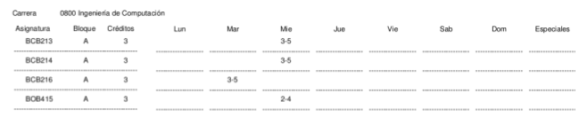
**Figura:** Ejemplo de lista general de DACE.

**Generación de oferta trimestral:** para esta etapa se genera un borrador de materias para entregar a DACE. No obstante, esta sujeto a cambios mientras haya revisiones de la oferta general de DACE. Esto significa que, el producto de esta etapa debe volver a pasar por la etapa anterior; generar una nueva oferta hasta que no hayan nuevas revisiones.

El formato de esta etapa será en CSV con la siguiente presentación:

* Código, Bloque, Lunes, Martes, Miercoles, Jueves, Viernes, Oferta Especial, Carrera, Operación.

## Especificación de reglas

En los archivos de salida de las dos etapas, una fila $x$ consiste en

$x = (cod1,bloque1,horarios,especial,carrera,operación)$

donde

   * $horarios$: son las posiciones de los dias en el siguientes orden:
        Lunes, Martes, Miercoles, jueves, viernes. En tales espacios son los
        horas.

   * $operación$: los valores son M(modificado), E(eliminar) , I(insertar) o
        vacio (en el archivo puede verse que no hay datos en tal campo).

Las reglas de comparación se aplican a todos los campos de la fila x salvo en $carrera$ y $operación$.
En el campo de $operación$ se anota el resultado de aplicar alguna regla.

Para la primera etapa, existen 3 reglas de comparación. Sea A un archivo de ofertas de DACE y B cada una de las ofertas departamentales:
* Si fila de A y B son iguales en sus campos, el resultado es vacio. En caso contrario, se escribe la fila de A como resultado, el resultado es M.

* Si una fila de A no existe en B, su operación es E. Se escribe en el archivo final.

* Si una fila de B no existe en A, su operación es I. Se escribe en el archivo final.


Para la segunda etapa, existen 3 reglas de comparación y se apoyan en los resultados de la primera etapa. Sea A un archivo CSV de la primera etapa y B un archivo de ofertas general de DACE:

* Si una fila de A con operación M, es no igual en sus campos a una de B, se escribe la fila de A.

* Si una fila de A con operación E, no existe en B, se escribe la fila de B.

* Si una fila de A con operación es I, no existe en B, se escribe la fila de A.

* Si una fila de A con operación vacia no existe en B, se escribe la fila de A con operación I. Por otra parte, si se encuentra y no son iguales sus campos, se agrega la fila de A con operación M.

# Diseño e implantación

La implantación del procesador de horarios se realizó con el lenguaje de programación Python versión 3.4. Sin embargo, no existe incompatibilidad en versiones posteriores.

Las dependencias externas a la biblioteca estandar de Python son las siguientes:

* Libreoffice
* PyMupdf
* xlrd

## Arquitectura

El procesador de horarios consta de 6 módulos. Tres módulos se encargan de la lectura de las ofertas departamentales a saber: `procesadorDOC`, `procesadorXLS`, `procesadorPDF`. El `procesadorDACE` espera un archivo PDF que contenga el formato que se observa en la imagen de abajo. El módulo de `funcionesAuxiliares` contiene funciones de apoyo a los procesadores anteriores. El `procesadorOfertas` es el programa principal y donde reside la lógica del sistema. El script `procesadorOfertas.sh` se utiliza para abstraer detalles de ejecución, detectar errores y automatizar la conversión de archivos DOC a FODT(XML de libreoffice).

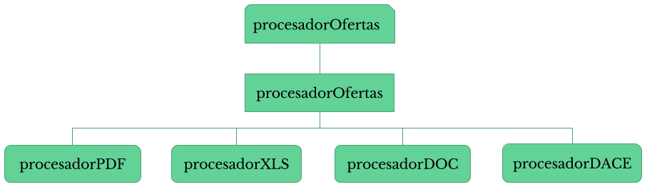
**Figura:** Arquitectura del procesador de horarios


### Captura de datos

Debido a la diferencias de formatos, dificultades de reconocimiento y estilos en como se presenta la información, los procesadores pueden reconocer datos, de acuerdo, a dos estilos a saber:

* **Estilo general:**
Código, Nombre Asignatura, Bloque, Lunes, Martes, Miercoles, Jueves, Viernes, Carrera.

	Sólo cualquier otro campo adicional se omitirá y sólo se relevante para el procesador los siguientes: código, bloque, lunes, martes, miercoles, jueves, viernes y, opcionalmente, carrera.

	Los módulos `procesadorPDF` y `procesadorXLS` fueron diseñados para reconocer este estilo. No obstante, procesadorXLS puede reconocer, adicionalmente, un campo denominado `especiales`.

* **Estilo departamento de computo:** Códigos, Bloques o sección, horarios.
	Los `bloques` pueden aparecer en `Códigos` o no existir.

	El `procesadorPDF` y el `procesadorDOC` pueden manejar estos estilos.


## Ejecución

El procesador de horarios se ejecuta utilizando la linea de comando, a través del interprete de Python o haciendo uso del script para sistemas tipo Unix. Se recomienda usar el script `.sh`.

Para ayudar familiarizarse con la ejecución, la aplicación dispone de una opción de ayuda usando la opción -h como sigue:

`procesadorOferta.sh -h`

Además, se escribió un documento de ayuda para instalar, configurar y ejecutarla. Se encuentra entre los archivos de la aplicación.

Para ejecutar la aplicación se escribe lo siguiente: 


* **Primera etapa:**

`procesadorOferta.sh -e directorio/a/insumos -d preoferta_0800.xls 
    -f directorio/a/archivo_de_salida.csv -m archivo_diccionario_materias`

Al usar `-d` y `-m` se asume que estos archivos están en el directorio de insumos.

* **Segunda etapa:**

`procesadorOferta.sh -r -d oferta_dace.pdf 
    -f directorio/a/archivo_de_salida.csv 
    directorio/a/archivo_de_preoferta.csv`


## Pseudocódigos

El procesadorPDF procesa un archivo PDF de la siguiente manera:
```
    archivoXML = pdf2xml(archivoPDF)
    while (!eof(archivoXML))
        linea = archivoXML.leerLinea()
        if !cabeceraLista
            cabeceraLista = analizarCabecera(linea)
        else
            listaMatBloq.anexar(extraerCodMat(linea))
            listaMatBloq.anexar(extraerBloque(linea))
            listaHorarios.anexar(extraerHorarios(linea))

    foreach fila in listaMatBloq
        Componer fila con horarios respectivos.
        if (fila.Cod_mat no esta la lista de materias requeridas)
            Eliminar fila
        listaOfertas.anexar(fila)

    foreach fila in listaOfertas
        filaCSV = fila_a_csv(fila)
        salida.escribir(filaCSV)
```

El procesadorDOC procesa un archivo FODT, producto de una función de `libreoffice.`

```
    while (!eof(archivoFODT))
        linea = archivoFODT.leerLinea()
        codMat = extraerCodMat(linea)
        bloq = extraerBloque(linea)
        hor = extraerHorarios(linea)
        especiales = extraerEspeciales(linea)
        fila = [codMat,bloq,hor,especiales]
        if (fila.Cod_mat no esta la lista de materias requeridas)
            Eliminar fila
        filaCSV = fila_a_csv(fila)
        salida.escribir(filaCSV)
```

El procesadorXLS procesa un archivo XLS mediante la dependencia xlrd.

```
    foreach fila in archivoXLS.
        if !cabeceraLista
            cabeceraLista = analizarCabecera(linea)
        else
            if (fila.Cod_mat no esta en lista de materias requeridas
            || fila.Carrera != '0800')
            continue

        filaCSV = fila_a_csv(fila)
        salida.escribir(filaCSV)
```

Para generar una primera oferta trimestral, esto es, la primera etapa:
```
    listaMaterias = cargarMateriasRequeridas()
    (listasOfertas, listaDaCE) = cargarOfertas
    						(args,dirBase,listaMaterias,nomArchDace)
    primeraOferta = generarOferta(listaOfertas,listaDACE)
    escribirResultados(primeraOferta,archSalida)
```

Para generar ofertas trimestrales contra un listado de DACE, esto es, la segunda etapa:

```
    listaOfertas = cargarOfertaPrimera(nombreArchivoOferta)
    listaGenDace = cargarListaGeneralDace(nombreArchivoDacePDF)
    resultado = analizarComparar(listaOfertas,listaGenDace)
    resultadoCSV = a_CSV(resultado)
    salida.escribir(resultadoCSV)
```

# Plan de pruebas y resultados

Para evaluar la capacidad del procesador de horarios, se realizaron pruebas en los siguientes ambitos:

   * **Procesamiento de formato:** se evalúa la capacidad de captura de datos de los procesadores. Esto son: procesadorDACE, procesadorDOC, procesadorPDF, procesadorXLS.

   * **Procesamiento de primera etapa:** se evalúa la salida del programa para la primera etapa. Se espera que el programa analice y etiquete cada ofertas en función de las operaciones: E, I, M.

   * **Procesamiento de segunda etapa:** se evalúa la salida del programa para la segunda etapa. Se espera que el programa reuna las materias correctas para un trimestre determinado.

## Procesamiento de formato

Los casos de pruebas son archivos que corresponda a cada procesador. Estos casos fueron elaborados de la siguiente manera:

* **Archivos con datos ficticios:** fueron diseñados para ejercitar las capacidades del procesador en cuestión. La información fue tomada de los archivos reales con ligeras variaciones.

    Se presentan con la nomenclatura:
    >   docX.[extensión]
    >   donde X: es el numero del caso de prueba.

    Si hay 3 versiones de formato de un mismo doc, entonces la validación es la misma para todos; por ejemplo, si existen doc1.pdf, doc1.xml y doc1.xls, la información reconocida, pese a la diferencias de formatos, es igual para todas.

* **Archivos con datos reales:** se usan para validar la información y para verificar reconocimiento de patrones de información.

## Procesamiento de primera etapa y segunda etapa

Se utilizan los archivos de ofertas trimestrales facilitados por la coordinación de computación. Existen dos casos de pruebas:

* **SD2016:** Se usaran las ofertas departamentales, la preoferta 0800 a Dace del trimestre septiembre-diciembre 2016.

* **EM2017:** Se usaran las ofertas departamentales, la preoferta 0800 a Dace del trimestre enero-marzo 2017.

Para la segunda etapa, se usa la lista general de DACE para tal periodo.

# Conclusión
El procesador de horarios fue implantado exitosamente para cubrir los formatos y archivos planteados anteriormente. No obstante, queda el problema cuando los formatos de archivos y/o estilos de ofertas departamentales cambien. Para el caso de formatos de archivos, el procesador se puede extender fácilmente y adaptarse al módulo principal. Por otra parte, si cambian los estilos se hará necesario implementar nuevos reconocimientos sin descartar los que se hayan implementado. El `procesadorXLS` es el reconocedor más flexible para cambios en cuanto estilos de presentación de la información.

En cuanto a las pruebas, se realizaron 20 casos de pruebas de procesamiento: 12 para casos con datos ficticios y 7 usando datos reales de la coordinación. Se realizaron 3 pruebas para primera etapa y 2 para la segunda etapa. Una de las pruebas consistió en generar la oferta del trimestre Enero-Marzo 2017 para ambas etapas.


# Apéndice

## Casos de pruebas con datos ficticios creados para procesamiento

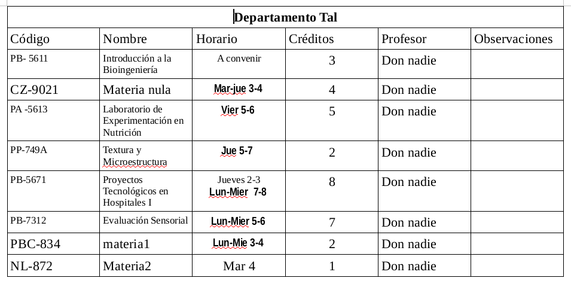
**Figura:** Reconocer materias sin horario. Versión DOC.

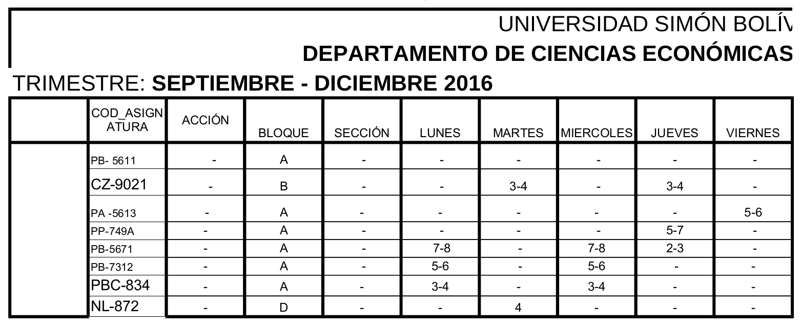
**Figura:** Reconocer materias sin horario. Versión PDF.

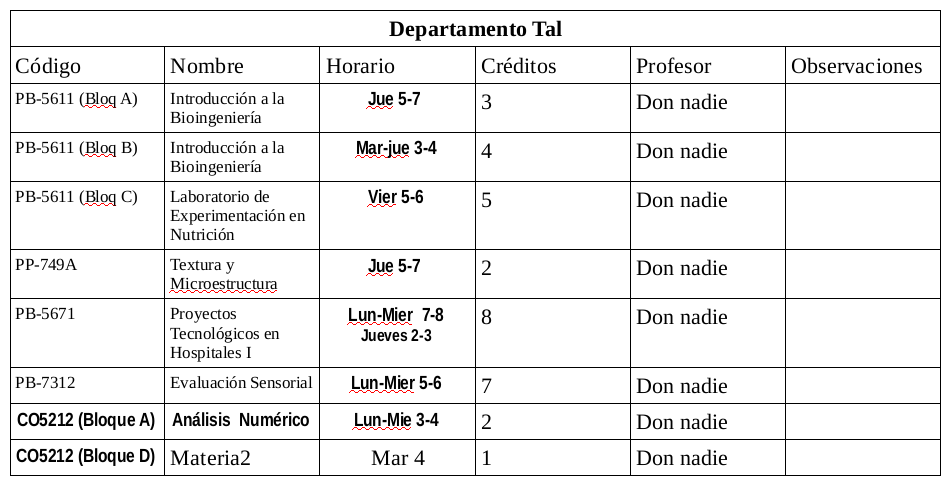
**Figura:** Reconocer materias con varias secciones y una hora. Versión DOC.

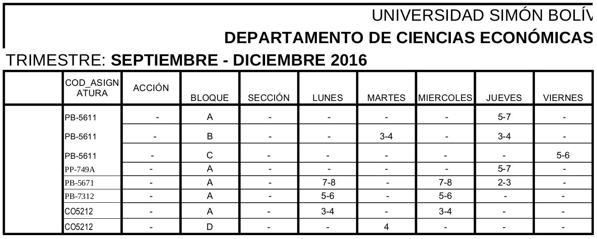
**Figura:** Reconocer materias con varias secciones y una hora. Versión PDF.

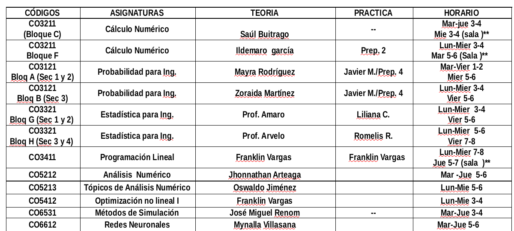
**Figura:** horarios desorganizados y reconocimiento de todas las materias. 

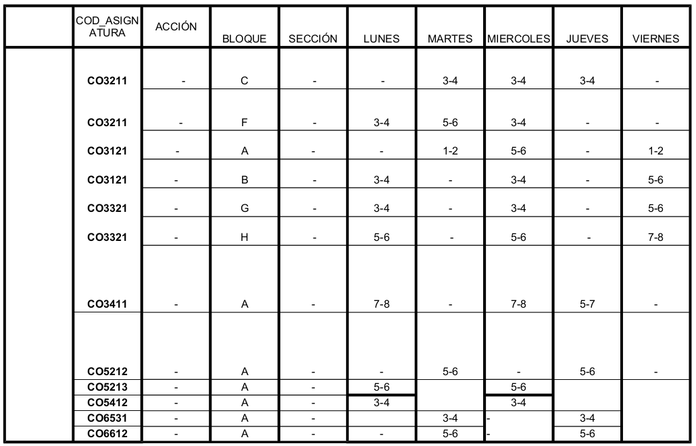
**Figura:** reconocimiento de todas las materias

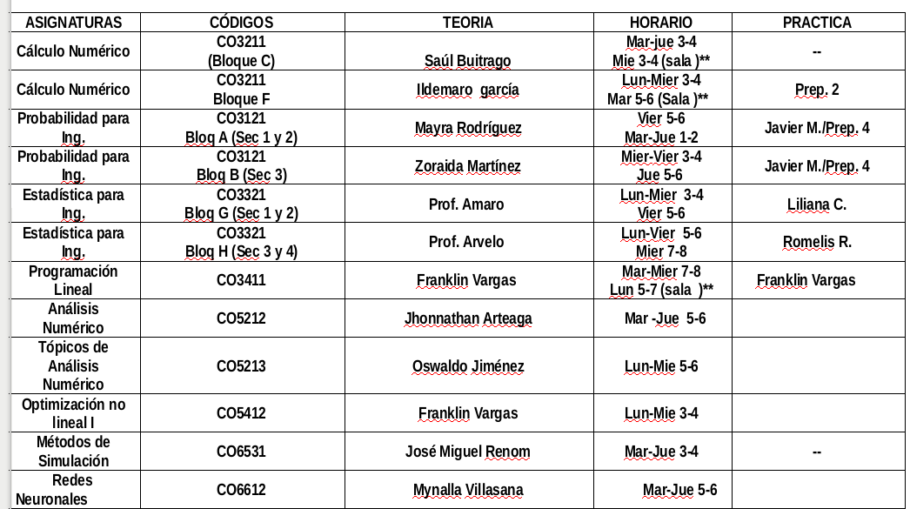
**Figura:** orden de los campos cambiados. Versión PDF.

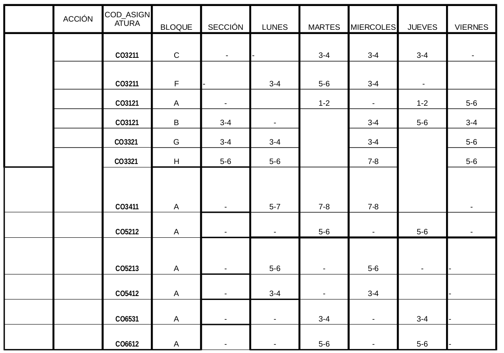
**Figura:** orden de los campos cambiados.

# Anexos

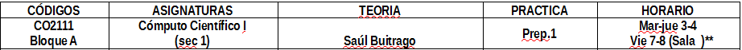
**Figura:** Estilos de oferta del cepartamento de cómputo.

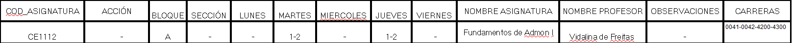
**Figura:** Estilo de ofertas del departamento de ciencias ecónomicas.

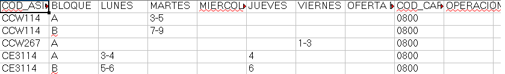
**Figura:** Estilo de oferta de la lista de ofertas de DACE.

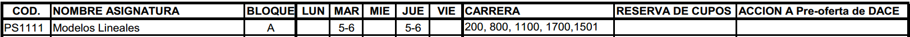
**Figura:** Estilo de ofertas del departamentos de sistemas.


# Bibliografía

[Repositorio de XLRD](https://github.com/python-excel/tutorial)  

[Documentación de XLRD](http://xlrd.readthedocs.io/en/latest/)  

[Repositorio del procesador de horarios](https://github.com/javierlopm/sistemaPermisosComputacion)  

[Documentación de pyMuPDF](http://pythonhosted.org/PyMuPDF/installation.html)
