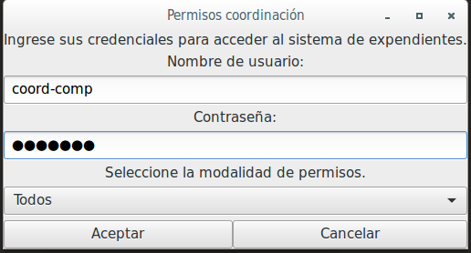
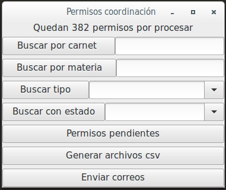
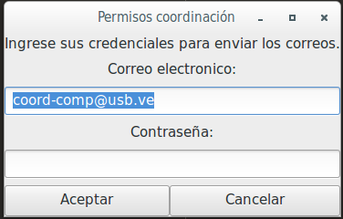
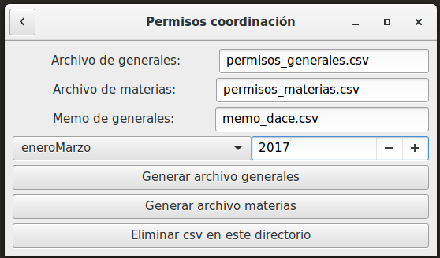
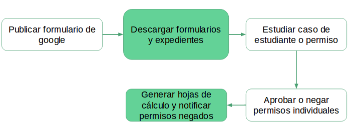

\newpage

# Introducción
(Dejar para el final)
Desde que comenzó el auge y la masificación de la informática los sistemas de información han cumplido un papel fundamental para reemplazar los métodos manuales de procesar datos, disminuyendo de esta manera el uso de materiales físicos y horas de trabajo considerablemente.

En el caso de la Universidad Simón Bolívar, a pesar de que existan avances en el uso de la tecnología en bastantes áreas administrativas, aún es posible encontrarse con espacios donde los protocolos se llevan de manera manual, ocasionando una serie de inconvenientes que sumados a la crisis universitaria por la cual la Universidad Simón Bolívar está pasando pueden ser realmente perjudiciales.

Hoy en día existe una gran cantidad de herramientas útiles y de acceso libre que sirven para desarrollar software utilizando tan solo un computador personal y conocimientos adquiridos durante la carrera de Ingeniería de la Computación, de manera considerablemente rápida y lo suficientemente poderosa para el problema a resolver.

Este informe tiene como objeto servir de explicación de como utilizando algunas de estas herramientas fue resuelto un problema de ineficiencia burocrática de tiempo y recursos mediante la aplicación de conocimientos del área de la computación como parte de un Miniproyecto de Desarrollo de Software.

# Resumen
(Dejar para el final)
Durante el desarrollo del presente se explicarán a detalle puntos esenciales para entender el trabajo ejecutado y el objetivo del mismo.

Se comenzará planteando el problema, explicando la situación de la coordinación de Ingeniería de la Computación donde el procesamiento de permisos funciona de manera manual, haciendo uso de una planilla donde los estudiantes llenan un formulario solicitando su permiso, lo cual requiere un uso considerable de papel y tinta para imprimir además de ser un problema de personal para la coordinación ya que la coordinadora debe procesar manualmente cada permiso y revisar el expediente de cada estudiante solicitante, tomar la decisión que se considere apropiada y luego escribir manualmente los archivos de tipo CSV en el formato que recibe DACE. En esta sección también es mencionada.

Luego de esto, se mencionan los objetivos del Miniproyecto, sección donde se explica la manera en la que se resolverá el problema planteado una vez culminado el Miniproyecto. En esta sección son explicados los módulos del programa donde se le provee a los distintos actores que interactuarán con el sistema interfaces para realizar sus funciones correspondidas así como también los módulos que realizan de manera automatizada procesos que solían ser manuales.

Después comienza la parte de análisis, donde se explica de una manera menos general y más técnica la lógica de programación del sistema así como también el detalle de la arquitectura utilizada en el mismo, tales como la explicación de cada módulo y el lenguaje de programación junto a todas las librerías utilizadas en el desarrollo.

Por último, en el informe se habla del plan de pruebas y los resultados. En esta parte se explica el procedimiento utilizado para probar cada módulo del sistema, conseguir errores y repararlos de manera segura. También se mencionan los resultados obtenidos una vez realizada la prueba y procesados los permisos.

# Planteamiento del problema

La Coordinación de Ingeniería de Computación trimestralmente y como parte de sus funciones debe controlar los permisos de inscripción de los estudiantes adscritos a esta carrera, en los cuales se contempla la inscripción de materias electivas, límite de créditos (superiores e inferiores a la norma), materias cuyos requisitos no han sido cubiertos totalmente y materias fuera del plan de estudio por nombrar algunos. 

Para que los estudiantes de Ingeniería de Computación pudieran solicitar sus permisos debían llenar planillas que la coordinación proporcionaba, en donde era necesario escribir los permisos requeridos y marcar en un grafo (que representa el pensum de la carrera) las materias aprobadas, las cursadas en el trimestre actual y las que se desean inscribir.

La coordinación, para que los estudiantes realizaran este proceso debía imprimir planillas de permisos para cada uno, recibirlas después de llenadas y resolver las posibles inquietudes de cada estudiante. Posteriormente para procesar cada permiso, la coordinadora debía descargar todos los expendientes de los estudiantes para comprobar que los grafos llenados por ellos coincidieran con los datos oficiales de la universidad. Luego, tomando en cuenta el índice de los estudiantes, su situación y la cantidad de cupos disponibles para cada asignatura procedía a aprobar o negar los diferentes permisos soliticitados. 

Adicionalmente a esto, es necesario enviar correos a cada una de los estudiantes cuyas solicitudes de permiso han sido negadas para que reconsideren su plan de inscripción. La generación de cada uno de estos correos personalizados se realizaba uno a uno manualmente.

Por último, la coordinación con los datos de los permisos aprobados, generaba de forma manual tres hojas de cálculo para DACE: uno para los permisos de asignaturas, un memo con los permisos de generales y un tercer archivo con datos con permisos generales y de límites de créditos.

Para los permisos del trimestre enero-marzo 2017, hubiese sido necesario procesar de forma manual los permisos de más de 140 estudiantes, lo cual representa, aproximadamente 400 permisos diferentes. La única etapa en el procesamiento de permisos apoyada por software adaptado a las necesidades de la coordinación era la visualización del grafo de los estudiantes, el cual es uno de los módulos realizados como parte de un miniproyecto anterior.

El miniproyecto precedente consistía en una aplicación móvil la cual requería un servidor para atender las solicitudes de todos los estudiantes y una aplicación de escritorio para el procesamiento de estos. Los inconvenientes encontrados con el uso de esta aplicación radicaban en: la ausencia de un servidor para el alojamiento de la aplicación, la ausencia de un módulo para descargar los expendientes de los estudiantes y fallas en el cumplimiento de los requerimientos de coordinación (todos los permisos de un estudiante eran tomados como una unidad monolítica en vez de elementos individuales).


# Objetivos del miniproyecto

El objetivo de este Miniproyecto de Desarrollo de Software es implementar un sistema capaz de proveerle a los estudiantes de Ingeniería de la Computación de la Universidad Simón Bolívar una herramienta para solicitar los permisos relacionados con la inscripción de materias de una manera más fácil y cómoda de utilizar y a su vez mucho más barata y ecológica ya que como se mencionó en el punto anterior, quedaría eliminado el uso innecesario de papel y tinta de impresiones para la solicitud de estos permisos.

A su vez, del lado del procesamiento de los permisos, es objetivo del Miniproyecto proveerle a la coordinadora de la carrera un programa con interfaz sencilla, efectiva y poderosa para el procesamiento manual de los permisos solicitados por los estudiantes. La herramienta provista deberá ser capaz de descargar los permisos, almacenarlos, descargar los respectivos expedientes académicos de manera automática, llevar control de su estado de aprobación y una vez finalizado todo el procesamiento, debe poder notificar a los estudiantes el estado de sus permisos y generar archivos en formatos específicos para la Dirección de Adimisión y Control de Estudios (DACE)

Todo lo mencionado logrará cumplir con el objetivo general de este Miniproyecto de automatizar una serie de tareas que hasta este trimestre han sido manuales y ahorrar una cantidad considerable de tiempo, esfuerzo y dinero a la coordinación de Ingeniería de la Computación.

# Análisis

Para entender mejor el sistema presentamos paso a paso el proceso que realiza la coordinación para poder dar respuesta a las solicitudes de permioso, primero se presentará el algoritmo de trabajo seguido y posteriormente las reglas necesarias para el cumplimiento de los objetivos iniciales del miniproyecto.

## Flujo de trabajo posterior a la implemenación

Luego de la implemenación del sistema procesador de permisos, la coordinación para poder procesar los permisos debe publicar el link al formulario de permisos y activarlo para aceptar las respuestas de los estudiantes, al terminar el período de soliticiud se desactiva el formulario y se inicia el procesamiento. 

Antes procesar todas las respuestas estudiantes la coordinadora deberá utilizar el módulo de *descargar permisos* (ver figura 1 \ref{fig1}), el cual descargará la hoja de cálculo (alojada en Google Drive), adicionalmente a esto se descargarán los expedientes académicos de todos los estudiantes presentes en la solicitud y se generarán de forma automática los flujográmas respectivos representando las materias ya cursadas



Posteriormente la coordinación puede aprobar y negar permisos, para ello se debe utilizar el módulo *programa de permisos* en donde se pueden realizar diferentes consultas sobre los estudiantes, buscar permisos por materia, por tipo de permiso y por estado (ver figura 2 \ref{fig2}). También se requiere hacer un análisis



Por último con los módulos de *enviar correos* (figura 3 \ref{fig3} y 4 \ref{fig4}) y *generar archivos csv* se envían las notificaciones a cada estudiante si sus permisos fueron negados y se generan las tablas para DACE en formato CSV (Comma-Separated Values). 



Antes de iniciar un nuevo proceso de recepción de permisos se debe limpiar la hoja de cálculo de Google Drive y la base de datos de la aplicación de escritorio.

De forma resumida el flujo para el procesamiento de permisos se realiza en los siguientes pasos:

1. Limpiar hoja de cálculo y base de datos, activar y publicar el formulario
1. Descargar permisos de estudiantes
1. Aprobar y negar permisos
1. Enviar correos y tablas de resultados

De forma gráfica la figura 5 representa los pasos a tomar, en donde los bloques coloreados son las acciones ya automatizadas y las restantes las cuales solo pueden ser realizadas de forma manual.




## Especificación de reglas

Las reglas de trabajo pueden ser especificadas en los siguientes 4 conjuntos:

* Restricciones de formulario y permisos
* Visualización de datos en pantalla
* Formato de tablas para dace
* Especificación de correos

Las restricciones se relacionan directamente con diferentes aspectos como la base de datos, la interfaz gráfica, las reglas de trabajo que son parte del procesamiento de los permisos y el formato de salida del programa. A continuación serán presentadas las reglas de cada uno de estos conjuntos.

### Restricciones de formulario

Antes de seleccionar Google Form como herramienta para almacenar las solicitudes se tuvo que verificar que la plataforma tuviese soporte para la verificación de credenciales institucionales y lo cumplió, adicionalmente fue elegida ya que se tenían restricciones en cuanto al uso de servidores para alojar una aplicación web propia y esta solución ya se había intentando en el miniproyecto anterior sin éxito.

Al diseñar el formulario que los estudiantes llenarían se tomó en cuenta el formato ya existente para poder cubrir de manera completa todos los tipos de permisos necesarios, también fue necesario realizar verificaciones de campos mediante expresiones regulares, rangos numéricos y de opciones de permisos que eran mutuamente excluyentes.

### Visualización de datos en pantalla

Los requerimientos de la interfaz incluían las siguientes reglas puntuales:

* Poder observar los grafos con materias aprobadas.
* Permitir la consulta todos los permisos pendientes y tenerlos de forma adyacente para poder procesarlos de manera rápida.
* Visualización de todos los permisos de un tipo específico.
* Consulta para los permisos de materias electivas y visualización de la cantidad de permisos ya aprobados y pendientes para poder decidir a que estudiantes otorgar los puestos disponibles (los cuales son limitados)
* Que permitiera observar todos los permisos de un estudiante para poder estudiar mejor su situación académica y para decidir con base en su conjunto de datos (índice, créditos aprobados, materias aprobadas).
* Visualización de los datos personales de los estudiantes para poder tener comunicación si es necesario (correos, número de teléfono y nombre)

Todas estas reglas fueron seguidas en la implemenación del sistema.

### Formato de tablas

Las tablas generadas debían estar en formato xls o xlsx, o cualquier otro que pudiese ser importado por Libre Office y pudiese ser exportado a un archivo con alguna de las extensiones ya mencionadas.

En cuanto a las reglas de generación de las tablas, cada uno de los tres archivos requeridos por DACE requiere un orden de las columnas como se puede observar a continuación en formato CSV:

* Para el archivo de materias
```
COD_ASIGNATURA,ANIO_CARNET,NUM_CARNET,SIGLO,ANIOP,MESIP,
MESFP,BLOQUE,SECCION,NRO_CREDITOS,PERMISO,RENGLON,
NOTA_ASIGNATURA,IND_NOTA_SIN_EFECTO
```


* Para el archvivo de permiso generales
```
ANIO_CARNET,NUM_CARNET,SIGLO,ANIOP,MESIP,MESFP,SITUACION,
SITUACIONINSCRIP,GENERAL,LIMITE CR,
=NOTA_X_CREDITO_PONDERADO,TOTAL_CREDITOS,PP
```

* Para el memo
```
N°,CARNÉ,NOMBRES Y APELLIDOS.,PERMISO,PERIODO
```

Cada permiso aprobado puede aparecer en uno o varios de estos archivos dependiendo de su tipo, para los dos primeros archivos mencionados existen algunos parámetros fijos como *"SIGLO"* el cual siempre posee un valor de *'1'* y *"PERMISO"* en donde vale *'s'* (ya que el archivo solo posee permisos aprobados).

Las columnas de *"ANIO_CARNET"* y *"NUM_CARNET"* poseen el carnet del estudiante separando el año de la cohorte del resto del número de 7 dígitos, 
las columnas *"ANIOP"*, *"MESIP"* y *"MESFP"* especifican el período para el cual será vaĺido el permiso mediante año, número de mes del inicio del trimestre y número del mes de finalización respectivamente.

Por último para cada tipo de permiso se deben generar las siguientes salidas en cada unos de los archivos:


* PP: Agregar créditos en archivo de materias
* Dos Generales: Agregar E2 en la columna "GENERAL" del archivo de generales y agrega en memo.
* Límite de créditos: agregar número de créditos en columna "LIMITE CR" del archivo de generales.
* Permiso de electiva: agregar código en columna "COD_ASIGNATURA" del archivo de materias.
* Sin requisito: agregar código de la asignatura en la columna "COD_ASIGNATURA" del archivo de materias.
* Se debe agregar el código de asignatura en "COD_ASIGNATURA" del archivo de materias y una línea el en archivo de memos para los siguientes tipos:
    - General extra
    - Extraplan
    - Extraplan de general más un general
    - Extraplan de general


### Especificación de correos

Para en el envío de correos se especificó que solo se enviaran correos a cada uno de estudiantes con permisos negados, debía ser un mensaje único especificando todos los permisos negados.

# Diseño

La aplicación se encuentra distribuida en los siguientes módulos y plataformas:

* Plataforma google: a través de google form los usuarios realizan sus solicitudes de permisos, estos resultados son almacenados en una hoja de cálculo disponible en google drive para ser procesada posteriormente por la aplicación de escritorio.
* Generador de grafos: módulo del miniproyecto anterior, genera archivos png con los grafos coloreados con las materias aprobadas de un estudiante cualquier en computación.
* Módulo de extración de expedientes: automatiza la búsqueda de expedientes mediante las credenciales de la coordinadora de computación, realiza consultas en la página [http://expediente.dii.usb.ve/] http://expediente.dii.usb.ve/ y almacena los archivos en formato html.
* Módulo csv: permite la generación de tablas en formato csv, requerido por dace, es el producto resultante del procesamiento de todos los permisos.
* Módulo de bd: mantiene en disco los datos de todos los estudiantes que se encuentran solicitando permisos, los tipos de permisos que requieren y el estado en el que se encuentran (aprobados, negados o pendientes).
* Módulo consulta de formulario: integra las hojas de cálculo de la plataforma de google, el de extracción de expedientes, generación de grafos y el manejador de base de datos.
* Aplicación de escritorio: unifica todos los módulos ya mencionados empleando una interfaz gráfica intuitiva para ser manejada por la coordinadora de computación.

Para el módulo de procesamiento de formularios y expedientes seguimos el siguiente algoritmo
```
proc procesar_formulario(form):
    por cada fila en form:
        obtener_expediente(fila['carnet'])
        generar_grafo(archivo_carnet,fila[carnet])
        insertar_en_bd(fila['datos_de_estudiante'])

        por cada permiso en fila:
            insertart_en_bd(permiso)
```

El diseño de las vistas para la aplicación de escritorio se realizó mediante la extensión de clases proporcionadas por Gtk para python. (CAMBIAR O ELIMINAR)

La correspondencia entre el diseño y la implementación programática del sistema se asocia de la manera expuesta en la siguiente tabla

| Módulo de diseño                   | Clase en la implementación                             |
|------------------------------------|--------------------------------------------------------|
| Plataforma google                  | Implementado directamente con la herramienta de Google |
| Generador de grafos                | createPngGraph.class                                   |
| Módulo de extración de expedientes | coord_crawler.py                                       |
| Módulo csv                         | csv_creator.py                                         |
| Módulo de bd                       | perm_store.py                                          |
| Módulo consulta de formulario      | check_answers.py                                       |
| Aplicación de escritorio           | main_app.py                                            |

## Arquitectura
Este miniproyecto fue desarrollado en *python3*, haciendo uso de las siguiente bibliotecas disponibles a través del manejador de paquete *pip*:

* gspread: utilizado para realizar consultas a las hojas de cálculo almacenadas en google drive.
* oauth2client: necesario para el proceso de autenticación de google drive.
* selenium: biblioteca para realizar automatizaciones sobre exploradores web, adicionalmente hacemos uso de chromium webdriver de 64 bits para mantener el explorador web en un entorno aislado e indpendente del administrador de paquetes del sistema operativo.  [1]
* gi, gi.repository,Gtk: bibliotecas estándar de python3 (en versiones nuevas), permiten crear interfaces de escritorio orientadas a eventos.
* easygui: biblioteca que provee ventanas y pop-ups de interacción preelaborados.
* sqlite3: *wrapper* de C en *python3* para el sistema de gestión de  bases de datos portable *sqlite3*. No requiere ser instalada, es parte de python3
* csv: biblioteca estándar de python3 que ayuda a generar archivos csv (Comma Separated Values), los cuales pueden ser importados en cualquier programa de hojas de cálculo (requerido por DACE).
* bs4: módulo de la biblioteca BeautifulSoup, parser de html, permite la extración del nombre, índice y número de créditos aprobados por cada estudiante desde su expediente.

Este proyecto, adicionalmente hace uso de de la máquina virtual de java 8 para la generación de los grafos de cada estudiante y del selenium webdriver (el cual es dependiente de la arquitectura x86_64 pero puede ser sustuido por x86).

La aplicación de escritorio ya se encuentra operativa en uno de los equipos de la coordinación.

## Plan de pruebas y resultados
(Describir el an y resultados de ejecución)
Durante el desarrollo del Miniproyecto constantemente cada módulo fue probado mediante permisos de prueba creados por los desarrolladores directamente en el formulario de Google los cuales cumplían la función de asegurar la inexistencia de errores en el procesamiento para cada tipo de permiso.

Al momento de finalizado el sistema con todos sus módulos listos se decidió que la mejor manera de realizar la prueba era mediante la solicitud de permisos formal para el trimestre Enero - Marzo 2017, de esta manera se propagó por todos los medios al alcance el link hacia el formulario de Google donde los estudiantes por una semana enviaron sus solicitudes de permisos que vendrían siendo la primera suite de pruebas completa para el sistema desarrollado.

Esta decisión para las pruebas se debió a que en caso de cualquier error estos no iban a significar algún tipo de pérdida de la información suministrada por los estudiantes asomando la posibilidad de realizar una segunda jornada de solicitud de permisos, ya que en la arquitectura del sistema al momento de tratar con la información almacenada en la nube es únicamente para su lectura. Se descargan los permisos, se almacenan localmente y luego se realiza cualquier prueba necesaria sobre éstos y en el peor de los casos sencillamente se vuelven a descargar sin ningún inconveniente. 

Proceso de realización de las pruebas:

* Recopilación de 416 permisos solicitados entre 142 estudiantes de Ingeniería de la Computación a través del Google Form.
* Pruebas de modificar errores cometidos por los estudiantes al momento de solicitar los permisos. Errores leves, reconocibles y fáciles de arreglar directamente en la hoja de cálculo en la nube.
* Procesamiento de los permisos.
* Creación de los CSV de salida de 366 permisos correctos procesados.
* Envío de correos anunciando permisos negados.

Durante la ejecución de las tareas mencionadas anteriormente se pudo comprobar la correctitud del sistema salvo por errores leves que fueron solucionados fácilmente sin exponer la integridad de los datos de los estudiantes en ningún momento.

Los resultados fueron 366 permisos procesados, 50 permisos incorrectos por errores de los estudiantes al momento de ingresar y tres archivos de tipo CSV con los resultados del procesamiento en el formato que recibe DACE.

Errores típicos de código solían ser de inconsistencia de datos. Por parte de los solicitantes de permisos solían ser ingreso de texto en campos de códigos de materias lo cual el sistema reconocía cada palabra como un código de materia lo cual no es causante de mayores inconvenientes ya que con ser dejados en modo "pendiente" son ignorados por el sistema al momento de generar la salida en CSV.


# Conclusión
(Dejar para el final)
Uno de los objetivos fundamentales de la carrera de Ingeniería de la Computación es formar a los estudiantes con conocimientos útiles para automatizar procesos y reducir el uso tanto de materiales físicos como de tiempo invertido en horas de trabajo.

Gracias al avance de la tecnología, la masificación de los dispositivos electrónicos y el acceso a internet, la libre propagación de conocimiento que se refleja en la gran variedad de herramientas libres para el uso de cualquiera y los conocimientos adquiridos en la carrera fue posible mejorar considerablemente el proceso administrativo realizado cada trimestre consecuente a la solicitud y procesamiento de los permisos para inscripción de trimestres.

La computación existe para facilitar y volver más eficiente el día a día de los seres humanos, eliminando problemas, reduciendo tiempos de esperas, uso de recursos que pudiesen ser costosos o poco ecológicos y reduciendo uso de energía, de manera que todos estos recursos mencionados puedan ser utilizados en otras áreas del día a día del hombre y así poder avanzar individual y colectivamente como humanidad.

# Bibliografía
(Dejar para el final)

[1] 